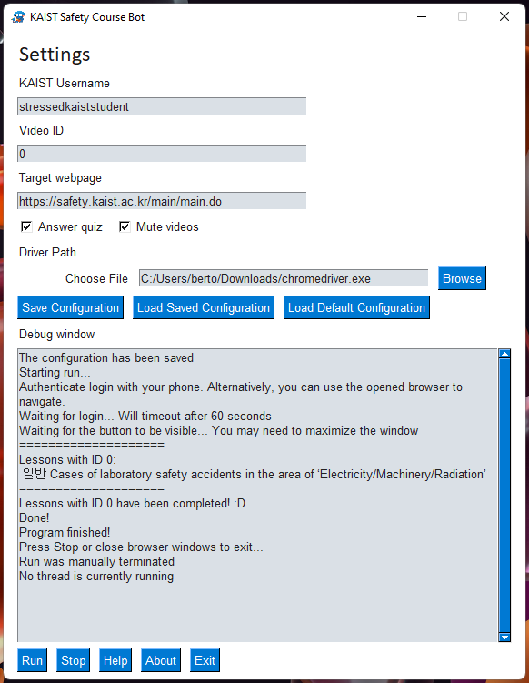

# KAIST Safety Course Bot

A bot for automatically completing the KAIST safety course.

> This bot makes viewing the (quite annoying) lab safety videos automatic, so you don't have to click many times on the videos that you need to see to complete the course. Also, considering that as of the time of writing the quiz can't be failed, the bot can additionally complete it too :D

## App Screenshot

<p align="center">
  
</p>

## Usage
First, choose you target courses in the [KAIST Safety Website](https://safety.kaist.ac.kr/main/main.do). Then:

- For Windows/Mac users:

1. We will be using Chrome and thus the [chromedriver](https://chromedriver.chromium.org/downloads) needs to be installed and moved in the right path (look it up on Google for installation help depending on your system).
3. From the [Release Page](https://github.com/fedebotu/kaist-safety-course-bot/releases/tag/v0.2.0), download and run files that fit your operating system.
4. Run the executable file
5. Modify settings (have a look at the [Configuration Settings](#configuration-settings)). NOTE: you need to modify the `driver_path` with the path where [chromedriver](https://chromedriver.chromium.org/downloads) is saved
6. Enjoy! 

- For Linux users (or developers):
We will be using Selenium for automating the webpages. The first step is to install it along with the requirements:
```shell
pip install -r requirements.txt
```
then, run

```shell
python kaist-safety-course-bot.py
```

## Configuration Settings
The bot will ask for a few configuration inputs:
- `answer_quiz`: (default=true): if true, the bot will also answer the quiz for you
- `driver_path`: (default=/usr/bin/chromedriver) your `chromedriver` path (look at Setup above)
- `mute_video` (default=true) mute video
- `target_webpage` (default='https://safety.kaist.ac.kr/main/main.do') target page
- `username` (default='YOUR_USERNAME') your KAIST username
- `video_id` (default=0) the video you want to watch signed with '정기' starting on the left

A `config.yaml` file will be saved so that you don't need to re-add these again.
You should then see some webpages automatically popping up and doing stuff!


## Important Note
The scope of these scripts is NOT to disregard lab safety, which is extremely important for researchers! The purpose is mainly to automate some boring stuff for fun - besides, don't you feel like a chad _cheating the system_?  

On a serious note, most people just find it annoying having to listen to mandatory courses they are not interested in so they skip them manually. The exam can just be passed by failing the first time and completing the answers after knowing the results.  So my question is: does this make sense? Why not just automate this tedious and - for most - time-wasting process?

PS: I'm not responsible for inappropriate use of this software of course ;) Feel free to contact me anytime though if you need help or have some feedback

## Known Issues
When the quiz is passed (>=60 points scored) the bot gets stuck since it cannot find the "NEXT" button. In this case, check if the quiz has been passed and you can stop the script with `Ctrl+C`. This could be fixed by checking the page source for keywords related to the completion.


## Changelog
- [v0.2.0](https://github.com/fedebotu/kaist-safety-course-bot/releases/tag/v0.2.0): new GUI
  - Added GUI with PySimpleGUI
  - In-app help and link
  - Add stoppable thread for selenium driver
  - Source code polishing
  - Misc. fixes
- [v0.1.0](https://github.com/fedebotu/kaist-safety-course-bot/releases/tag/v0.1.0): first release


## Contribute

Feel free to contribute and open Issue/PRs! 

Here are some ideas of things to be done:

- [x] Create executable for Windows/Mac
- [x] Add GUI
- [ ] Automate `chromedriver` installation
- [ ] Automatic course selection (everything would be automatic this way)
- [ ] Add tests for Windows version
- [ ] Add tests for Mac version
- [ ] Add tests for Linux version
- [ ] ... Any additional feedback!

You may also try reusing some code for automating something else ^^


---

PS: the original scope was to save time, but I took much longer to create this bot rather than just clicking on the screen myself and remembering the answers kkk. Hopefully though, it will save other people's time!

